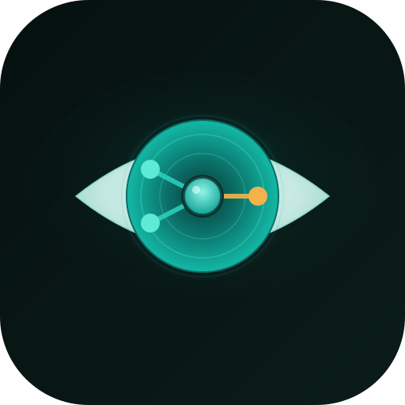

<p align="center">
  
</p>

<h1 align="center">Open Witness Engine</h1>

<p align="center"><strong>Decision provenance and shared operational memory for robot fleets.</strong></p>

<p align="center">
  <a href="LICENSE"></a>
  <a href="https://www.python.org/"></a>
  
  
</p>

Open Witness Engine (OWE) records what a robot *believed*, *why* it chose an action
over the alternatives, *what happened*, and *how a human corrected it* — then makes
that record queryable across a fleet. It is the semantic decision layer that sits
*above* raw recording (`rosbag2` / `ros2_tracing`), not a replacement for it.

It answers questions the raw logs cannot:

- Why was robot 3 assigned this delivery?
- Why did navigation enter recovery here?
- Which software change increased blocked-path failures?
- What did the previous operator do in a similar situation?

> This is **not** a robot brain. It observes and explains decisions; it does not make them.

## Safety boundaries (non-negotiable)

OWE is an **observation-and-memory** layer. These boundaries are enforced by
architecture, not policy, and must never be relaxed:

1. **Never in a safety or control path.** Not a controller, collision-avoidance,
   emergency-stop, SLAM, perception, or teleop-assist component.
2. **Advisory only.** OWE may *propose* a recovery or a preference — it must never
   *define* the safe action set. A trusted, deterministic gateway independent of OWE
   must mediate any action OWE ever suggests.
3. **Non-blocking and fail-open.** Ingestion is bounded-queue and asynchronous; the
   robot operates normally when OWE is slow, degraded, or down.
4. **Complements, does not duplicate, the flight recorder.** `rosbag2` and
   `ros2_tracing` keep the raw, timing-accurate evidence. OWE stores summaries,
   causal links, hashes, and *references* to those recordings — never raw sensor
   streams (images, point clouds, high-rate channels).

See [`docs/boundaries.md`](docs/boundaries.md) for the full rationale and the
standards context (ISO 26262 / SOTIF / UL 4600, EDR/DSSAD).

## What it captures

Every important task-level decision is stored as a `RobotDecisionEnvelope`: the
decision tuple *(world-state reference, goal, candidate actions, constraints,
software versions, selected action, outcome, human override)* plus fleet / robot /
mission / task identity, monotonic and wall clocks, and a per-source sequence for
ordering. Factual decision variables and **typed causal links** are persisted first;
an LLM can narrate them into human-readable explanations *afterward*, with citations —
never the other way around.

Causal edges: `caused_by`, `chosen_over`, `constrained_by`, `executed_as`,
`resulted_in`, `corrected_by`, `invalidated_by`, `superseded_by`.

## Status

**v0 — tested domain core + bridge foundation.** The off-robot decision model,
causal graph, provenance store, query surface, and the non-blocking capture bridge
(with Open-RMF / Nav2 adapter mappings), all built test-first. The ROS-specific I/O
is left as documented seams — the transport, translation, and mapping logic are pure
and tested without a running ROS stack.

```
src/open_witness_engine/
  envelope.py       # RobotDecisionEnvelope v1 and its sub-models
  causal.py         # typed causal edges + decision graph traversal
  store.py          # append-only, idempotent, ordered provenance store
  ordering.py       # source_seq / vector clock / idempotency primitives
  query.py          # why-did-X, version-diff, similar-operator-action queries
  bridge/
    pipeline.py     # Bridge facade: resilient capture() + drain()
    spool.py        # non-blocking, bounded, fail-open transport
    capture.py      # normalized DecisionObservation + envelope translation
    errors.py       # MalformedRecordError + safe field extraction
    rmf.py          # Open-RMF task-award -> DecisionObservation mapping
    nav2.py         # Nav2 behavior-tree -> DecisionObservation mapping
schemas/
  robot-decision-envelope.v1.json
```

The producer path is fail-open by construction. A ROS callback calls
`bridge.capture(adapter, record)`, which never blocks or raises: a malformed
record is counted and dropped, a healthy one is offered to the bounded spool. A
consumer calls `bridge.drain()` to translate spooled observations into validated
envelopes and append them, absorbing any per-record failure so one bad message
can never stall capture. Both loss modes are bounded and observable — malformed
records via `bridge.rejected`, overflow via `bridge.dropped` — and never
back-pressured onto the robot.

## Relationship to Open Timeline Engine

OWE reuses proven *design patterns* from [Open Timeline Engine](../open-timeline-engine)
— its event-ordering and idempotency primitives, its episodic→semantic and
corrections/supersession model, and its Lite/Full topology — reimplemented cleanly
here. It takes **no code dependency** on that project: the domains, data rates, and
quality bars differ, and OWE must stand on its own.

## Roadmap

1. **v0 (done):** tested domain core — envelope, causal graph, store, queries — plus
   the non-blocking bridge foundation (spool, capture/translation, Open-RMF and Nav2
   adapter mappings) with the ROS I/O left as documented seams.
2. **v0.1:** wire the adapter seams to live ROS 2 (`rmf_task_msgs`, Nav2 BT log) and
   run the bridge against Open-RMF / Nav2 in simulation, observation-only.
3. **v0.2:** persistent store (Postgres) + semantic retrieval over decision records;
   references and hashes to `rosbag2` / trace snapshots.
4. **Later (only if a real customer wedge is validated):** fleet aggregation,
   tamper-evident hash-chained audit, SROS2 identity mapping, operator-facing query UI.

## Development

```bash
python -m venv .venv && . .venv/bin/activate
pip install -e ".[dev]"
pytest
ruff check .
mypy src tests
```

See [CONTRIBUTING.md](CONTRIBUTING.md) for standards and the non-negotiable safety
invariants.

## Project docs

- [docs/boundaries.md](docs/boundaries.md) — the safety boundaries and their rationale
- [CHANGELOG.md](CHANGELOG.md) — what has shipped
- [MILESTONES.md](MILESTONES.md) — roadmap
- [SECURITY.md](SECURITY.md) — reporting, including safety-boundary violations
- [docs/plans/](docs/plans) — the original approved design
- [AGENTS.md](AGENTS.md) / [CLAUDE.md](CLAUDE.md) — guidance for coding agents

## License

Apache-2.0 — see [LICENSE](LICENSE).
